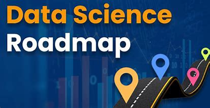

# Data Science Beginner Roadmap 🚀

Welcome to the Data Science Roadmap repository! 🌐

Embark on a thrilling journey through the world of data science with our comprehensive roadmap. Whether you're a beginner or an experienced data enthusiast, this guide is designed to help you navigate through the essential skills, tools, and concepts needed to excel in the field.

## Table of Contents 📑

1. [Introduction to Data Science](#introduction-to-data-science)
2. [Python Programming](#1-python-programming)
   - [W3Schools Python Tutorial](#w3schools-python-tutorial)
   - [YouTube Tutorials](#youtube-tutorials)
      - [English](#english)
      - [Hindi](#hindi)
3. [Numpy](#2-numpy)
   - [W3Schools Numpy Tutorial](#w3schools-numpy-tutorial)
   - [YouTube Tutorials](#2-numpy-youtube-tutorials)
4. [Pandas](#3-pandas)
   - [W3Schools Pandas Tutorial](#w3schools-pandas-tutorial)
   - [YouTube Tutorials](#3-pandas-youtube-tutorials)
5. [Data Visualization](#4-data-visualization)
   - [Matplotlib](#matplotlib)
   - [Seaborn](#seaborn)
6. [Feature Engineering](#5-feature-engineering)
   - [YouTube Tutorials](#5-feature-engineering-youtube-tutorials)
7. [Feature Selection](#6-feature-selection)
   - [YouTube Tutorials](#6-feature-selection-youtube-tutorials)
8. [Statistics](#7-statistics)
   - [YouTube Tutorials](#7-statistics-youtube-tutorials)
9. [Machine Learning](#8-machine-learning)
   - [YouTube Tutorials](#8-machine-learning-youtube-tutorials)
10. [ML WEB APPS using Flask / Streamlit ](#9-flask-and-streamlit)
11. [ML END TO END PROJECTS](#10-end-to-end-projects)
12. [ML-OPS TUTORIAL AND PROJECTS](#11-mlops-tutorial)
13. [Additional Things to Learn](#12-extra-things-i-learnt)

## Introduction to Data Science

Data Science is a multidisciplinary field that combines expertise from statistics, mathematics, and computer science to extract meaningful insights and knowledge from data. Whether you're interested in predictive modeling, data analysis, or machine learning, this roadmap will guide you through the essential steps to become a proficient data scientist.

**Ready to dive in? Let's get started!**

---

## 1. Python Programming

Python is a fundamental programming language in the data science ecosystem. Mastering Python is crucial for data manipulation, analysis, and machine learning. Here are some resources to kickstart your Python journey:

#### W3Schools Python Tutorial

W3Schools provides a comprehensive and beginner-friendly Python tutorial. It covers everything from basic syntax to advanced topics, making it an excellent resource for learners at all levels.

**Visit the [W3Schools Python Tutorial](https://www.w3schools.com/python/default.asp)**

#### YouTube Tutorials

##### English

Check out this English tutorial on YouTube, covering Python fundamentals and beyond. The content is engaging and perfect for visual learners.

**Watch the [English YouTube Tutorial](https://youtu.be/t8pPdKYpowI?si=6aRiZUl687Aax4bE)**

##### Hindi

For Hindi speakers, Campus X and Code with Harry offer comprehensive playlists on Python. Choose the one that best suits your learning style.

- Campus X: [Watch Campus X Playlist](https://youtube.com/playlist?list=PLKnIA16_Rmvb1RYR-iTA_hzckhdONtSW4&si=Fz7flAud1HEirN4I)
- Code with Harry: [Watch Code with Harry Playlist](https://youtube.com/playlist?list=PLu0W_9lII9agwh1XjRt242xIpHhPT2llg&si=cqX_PjPlWJhux8K3)

---
## 2. Numpy

Numpy is a fundamental library for numerical computing in Python. It provides support for large, multi-dimensional arrays and matrices, along with mathematical functions to operate on these elements. Here are some resources to kickstart your Numpy journey:

#### W3Schools Numpy Tutorial

W3Schools offers a comprehensive Numpy tutorial that covers key concepts and functionalities. Dive into the world of numerical computing with Numpy.

**Visit the [W3Schools Numpy Tutorial](https://www.w3schools.com/python/numpy/default.asp)**

#### YouTube Tutorials

##### English

Check out this English tutorial on YouTube by Patrick Loaeber , focusing on Numpy fundamentals and advanced topics. Enhance your data science and numerical computing skills with Numpy.

**Watch the [English YouTube Tutorial](https://youtu.be/9JUAPgtkKpI?si=A7BWfYGfxVt0mal_)**

##### Hindi

For Hindi speakers, explore this comprehensive Numpy playlist on YouTube. Code it UP provides tutorials in Hindi to help you grasp Numpy concepts effectively.

- **Watch the [Hindi YouTube Tutorial](https://youtube.com/playlist?list=PLmRclvVt5Dtlgy6PordwKtiUr7fwjuhfz&si=tLM-SUFVB_ODaUgF)**
---
## 3. Pandas

Pandas is a powerful data manipulation library in Python. It provides data structures like Series and DataFrame, allowing you to work seamlessly with structured data. Here are some resources to start your Pandas journey:

#### W3Schools Pandas Tutorial

W3Schools offers a comprehensive Pandas tutorial covering key functionalities for data manipulation and analysis. Dive into the world of dataframes with Pandas.

**Visit the [W3Schools Pandas Tutorial](https://www.w3schools.com/python/pandas/default.asp)**

#### YouTube Tutorials

##### English

Explore CodeBasics' Pandas playlist on YouTube, focusing on practical applications and use cases. Enhance your data manipulation skills with Pandas.

**Watch CodeBasics' [English Pandas Playlist](https://youtube.com/playlist?list=PLeo1K3hjS3uuASpe-1LjfG5f14Bnozjwy&si=Vjo5sBDLcYx_jnlz)**

##### Hindi

For Hindi speakers, Code with Harry provides a comprehensive Pandas tutorial on YouTube. Dive into data manipulation and analysis with Pandas in Hindi.

- Code with Harry: [Watch Code with Harry Pandas Playlist](https://youtu.be/RhEjmHeDNoA?si=5QvEldEj26KwU0BK)

---
## 4. Data Visualization

Data Visualization is a crucial aspect of data science. It allows you to represent complex data in a visual format, making it easier to interpret and analyze. Explore the following data visualization libraries:

### a. Matplotlib

Matplotlib is a versatile and widely used plotting library in Python. It provides a variety of charts, plots, and visualizations. Here are some resources to get started with Matplotlib:

- [W3Schools Matplotlib Tutorial](https://www.w3schools.com/python/matplotlib_intro.asp)

#### YouTube Tutorials

##### English

Explore WsCube Tech's Matplotlib playlist on YouTube. Learn to create stunning visualizations with Matplotlib in English.

- WsCube Tech: [Watch WsCube Tech's Matplotlib Playlist](https://youtube.com/playlist?list=PLc20sA5NNOvpG9WlvjY7XTDWPAFBNgv_N&si=c4lNS9oIKM_LobOR)

##### Hindi

For Hindi speakers, WsCube Tech provides a comprehensive Matplotlib tutorial on YouTube. Enhance your data visualization skills in Hindi.

- WsCube Tech: [Watch WsCube Tech's Matplotlib Playlist](https://youtube.com/playlist?list=PLjVLYmrlmjGcC0B_FP3bkJ-JIPkV5GuZR&si=mgivwf2UhzVtFyBJ)

### b. Seaborn

Seaborn is a statistical data visualization library based on Matplotlib. It simplifies the process of creating informative and attractive visualizations. Explore Seaborn with the following resources:

#### YouTube Tutorials

##### English

Check out WsCube Tech's Seaborn playlist on YouTube. Dive into advanced data visualization with Seaborn in English.

- WsCube Tech: [Watch WsCube Tech's Seaborn Playlist](https://youtube.com/playlist?list=PLc20sA5NNOvq8CldEUOZEHnoVIk4svXuZ&si=4qCuUnqX0SNqaomg)

##### Hindi

For Hindi speakers, WsCube Tech provides a comprehensive Seaborn tutorial on YouTube. Explore statistical data visualization with Seaborn in Hindi.

- WsCube Tech: [Watch WsCube Tech's Seaborn Playlist](https://youtube.com/playlist?list=PLjVLYmrlmjGfhqSO3rF4n02rrj9w2Ch2C&si=9AftKtcNiabEEiM2)

---

### NOTE :
**MAKE SURE TO DO SOME DATA ANALYSIS PROJECTS USING PYTHON , NUMPY , PANDAS , MATPLOTLIB and SEABORN**

---
## 5. Feature Engineering

Feature Engineering is a critical step in the data preprocessing pipeline. It involves transforming raw data into a format that enhances the performance of machine learning models. Explore the following Feature Engineering tutorials:

#### YouTube Tutorials

##### English

Krish Naik's YouTube playlist on Feature Engineering provides in-depth insights and practical examples in English. Learn valuable techniques to enhance your data features.

- Krish Naik: [Watch Krish Naik's Feature Engineering Playlist](https://youtube.com/playlist?list=PLZoTAELRMXVPwYGE2PXD3x0bfKnR0cJjN&si=lTSJv2mEwkEHljJo)

##### Hindi

For Hindi speakers, Campus X offers a comprehensive Feature Engineering tutorial on YouTube. Dive into the intricacies of feature engineering in Hindi.

- Campus X: [Watch Campus X's Feature Engineering Playlist](https://youtube.com/playlist?list=PLON7HclXUNvRf9xxqxY8LDXAgXa8Z_7vK&si=7r0uuJLXyHCk8NGa)

---

## 6. Feature Selection

Feature Selection is a crucial step in the data preprocessing pipeline, aiming to choose the most relevant features for model training. Explore the following Feature Selection tutorials:

#### YouTube Tutorials

- **English**
  - Krish Naik's YouTube playlist provides in-depth insights and practical examples on Feature Selection in English.
  - [Watch Krish Naik's Feature Selection Playlist](https://youtube.com/playlist?list=PLZoTAELRMXVPgjwJ8VyRoqmfNs2CJwhVH&si=UcmAs2vdEzYlj_rg)

---

## 7. Statistics

Statistics is the foundation of data science, providing essential tools for data analysis and interpretation. Explore the following Statistics tutorials:

#### YouTube Tutorials

- **English**
  - Krish Naik's YouTube video provides a comprehensive introduction to Statistics in English.
  - [Watch Krish Naik's Statistics Video](https://youtu.be/LZzq1zSL1bs?si=vvExo9rU-jA7C8vL)

- **Hindi**
  - Krish Naik's YouTube playlist covers Statistics concepts in Hindi.
  - [Watch Krish Naik's Hindi Statistics Playlist](https://youtube.com/playlist?list=PLTDARY42LDV6YHSRo669_uDDGmUEmQnDJ&si=s-ztMZ6I_6mWMOzh)

---

## 8. Machine Learning

Machine Learning is a core component of data science, allowing computers to learn from data and make intelligent decisions. Explore the following Machine Learning tutorials:

#### YouTube Tutorials

- **English**
  - Krish Naik's YouTube video provides an insightful overview of Machine Learning in English.
  - [Watch Krish Naik's Machine Learning Video](https://youtu.be/JxgmHe2NyeY?si=7Bevyq2ipSDF864Y)

- **Hindi**
  - Krish Naik's YouTube playlist and Campus X's playlist cover Machine Learning concepts in Hindi.
  - Krish Naik: [Watch Krish Naik's Hindi Machine Learning Playlist](https://youtube.com/playlist?list=PLTDARY42LDV7WGmlzZtY-w9pemyPrKNUZ&si=LzKbLcje04qmK0ic)
  - Campus X: [Watch Campus X's Hindi Machine Learning Playlist](https://youtube.com/playlist?list=PLKnIA16_Rmvbr7zKYQuBfsVkjoLcJgxHH&si=InW4A5IE0hkmPr7G)

---

### Note :

**DO SOME BASIC ML PROJECTS FROM YOUTUBE AND KAGGLE**

--- 
## 9. FLASK and Streamlit

Mastering web frameworks like Flask and Streamlit is essential for deploying and showcasing your data science projects. Choose one or explore both to enhance your skills.

### a. Flask

Flask is a lightweight web application framework in Python. It's widely used for building web applications and APIs. Explore the following resources to master Flask:

#### YouTube Tutorials

- **English**
  - Krish Naik's YouTube playlist provides a comprehensive guide to Flask in English.
  - [Watch Krish Naik's Flask Playlist](https://youtube.com/playlist?list=PLZoTAELRMXVPBaLN3e-uoVRR9hlRFRfUc&si=ZJcGFBHePDlKql1H)

- **Hindi**
  - Krish Naik's YouTube video covers Flask concepts in Hindi.
  - [Watch Krish Naik's Hindi Flask Video](https://youtu.be/KF-rDqQfqz0?si=G6_dYpAg53oFURnJ)

### b. Streamlit

Streamlit is a powerful tool for creating interactive web applications with minimal effort. It's particularly popular in the data science community for building interactive dashboards. Explore the following resources to master Streamlit:

#### YouTube Tutorials

- **English**
  - Data Professor's YouTube playlist covers Streamlit in English.
  - [Watch Data Professor's Streamlit Playlist](https://youtube.com/playlist?list=PLtqF5YXg7GLmCvTswG32NqQypOuYkPRUE&si=0bYer4_eolU4VB5_)

---

### Note :

**Now make some END-TO-END Machine Learning Web Apps using Flask and Streamlit given in 10th Section**

---

## 10. END TO END PROJECTS

Explore real-world machine learning projects that cover the entire project lifecycle, from data preparation to model deployment.

### 1. House Prediction

Predicting house prices is a classic machine learning task. Follow this project tutorial to build and deploy a house price prediction model:

- [Watch House Prediction Project](https://youtu.be/DVxkI1VmpCk?si=ofqV5nFm5utk--Bs)

### 2. Car Price Prediction

Learn how to predict car prices using machine learning techniques. This project takes you through the process of building and evaluating a car price prediction model:

- [Watch Car Price Prediction Project](https://youtu.be/iRCaMnR_bpA?si=qEK8XsQj3WXE6DtZ)

### 3. IPL Runs Predictor

Predicting runs in an IPL match is a challenging and exciting task. Follow this project to build a machine learning model that predicts runs in IPL matches:

- [Watch IPL Runs Predictor Project](https://youtu.be/Ok_zkfWC0gI?si=rtv5cWBZua29butB)

### 4. Other Projects Playlist

Explore a collection of various machine learning projects in this playlist. Each project covers different aspects of machine learning and provides valuable insights:

- [Watch Other Projects Playlist](https://youtube.com/playlist?list=PLfFghEzKVmjvuSA67LszN1dZ-Dd_pkus6&si=q5Rct8OUUgTdepVW)

---

## 11. MLOPS TUTORIAL

Master the art of deploying machine learning models into production with MLOps. Explore tutorials and projects to build a strong foundation and dive into MLOps practices.

### 1. FreeCodeCamp MLOps Tutorial

FreeCodeCamp provides an insightful MLOps tutorial, guiding you through the key concepts and practices of deploying machine learning models:

- [Watch FreeCodeCamp MLOps Tutorial](https://youtu.be/-dJPoLm_gtE?si=hckyLe9Ba8hU4v0G)

### 2. Krish Naik MLOps Tutorial

Krish Naik's MLOps tutorial offers valuable insights into deploying machine learning models efficiently. Learn the essential practices from an experienced data scientist:

- [Watch Krish Naik MLOps Tutorial](https://youtu.be/pxk1Fr33-L4?si=JUjbsOOZeSC2Aeqz)

### Build Your Own MLOps Projects

After gaining a strong foundation in MLOps principles, take the next step by working on your own MLOps projects. Apply your knowledge to deploy machine learning models in real-world scenarios and enhance your skills:

- **Tip:** Start with small projects and gradually move to more complex deployments. Experiment with different tools and platforms to find what works best for your projects.

**Pro Tip:**
Join MLOps communities and forums to stay updated on the latest trends, tools, and best practices. Collaborate with other professionals to share experiences and learn from real-world MLOps challenges.

---
## 12. Extra Things I Learnt

Explore additional skills and tools that complement your data science journey. Strengthen your knowledge in essential technologies that enhance your capabilities.

### 1. GitHub

Understanding version control is crucial for collaboration and project management. Learn the basics of GitHub with this informative tutorial:

- [Watch GitHub Tutorial](https://youtu.be/Ez8F0nW6S-w?si=qnBsewYWfRFOeIHo)

### 2. Docker

Containerization simplifies deployment and ensures consistency across environments. Dive into Docker with this comprehensive tutorial:

- [Watch Docker Tutorial](https://youtu.be/WNUCAPKa44Y?si=6TzIzUgRaTiHJF3u)

### 3. Basic SQL

A fundamental skill for data scientists, SQL is used for database querying and management. Get started with basic SQL concepts in this tutorial:

- [Watch Basic SQL Tutorial](https://youtu.be/hlGoQC332VM?si=4PyXP_l500OCfyaY)

### 4. Basic HTML and CSS for Web Apps

Enhance your ability to create interactive web applications. Learn the basics of HTML and CSS with this hands-on tutorial:

- [Watch HTML and CSS Tutorial](https://youtu.be/G3e-cpL7ofc?si=juhzlCnr6isBS47A)

**Pro Tip:**
These additional skills will complement your data science expertise and make you a well-rounded professional. Consider applying these skills to enhance your data science projects and create end-to-end solutions.

---
---
Happy learning and coding! 🚀
